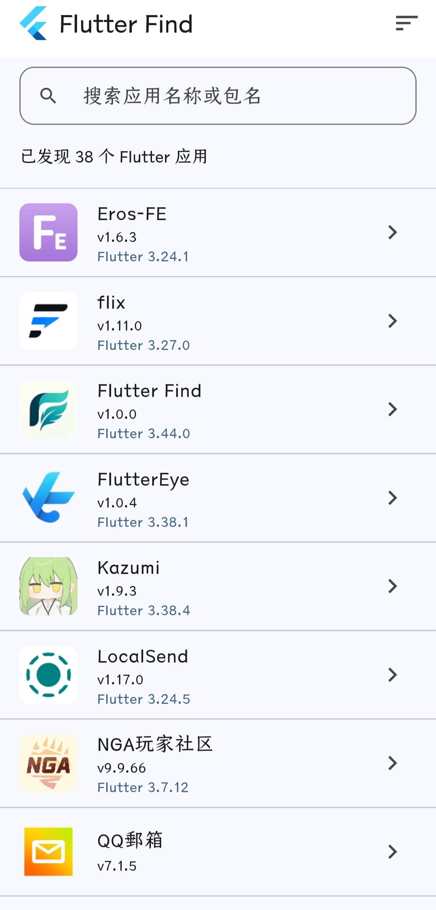

# Flutter Find

在 Android 设备上扫描已安装应用，识别由 Flutter 框架构建的 App，并展示 Flutter/Dart 版本与第三方依赖信息。

## 功能

- **自动扫描**：启动后自动枚举设备上的全部应用
- **Flutter 识别**：通过检测 `libflutter.so`、`flutter_assets` 等特征判断应用是否由 Flutter 构建
- **应用列表**：主页展示所有 Flutter 应用，支持按名称或 Flutter 版本排序、关键词搜索
- **应用详情**：查看应用名称、图标、版本号、包名、Flutter 版本、Dart 版本
- **依赖列表**：展示应用使用的第三方 pub 包
- **依赖详情**：点击依赖包名可查看 pub.dev 上的描述，并跳转官方页面
- **仅支持 Android**：非 Android 平台启动时显示友好提示页面

## 屏幕截图



## 环境要求

- Flutter SDK 3.44.0
- Dart SDK 3.12.0
- Android 设备或模拟器（API 21+）

## 快速开始

```bash
# 安装依赖
flutter pub get

# 生成引擎版本映射表（可选）
python tool/generate_engine_release_map.py

# 运行到 Android 设备
flutter run
```

## 技术栈

### Flutter (Dart)

| 技术 | 用途 |
|------|------|
| [flutter_riverpod](https://pub.dev/packages/flutter_riverpod) | 状态管理 |
| [go_router](https://pub.dev/packages/go_router) | 路由管理 |
| [http](https://pub.dev/packages/http) | HTTP 请求（调用 pub.dev API） |
| [url_launcher](https://pub.dev/packages/url_launcher) | 打开外部链接 |
| [flutter_svg](https://pub.dev/packages/flutter_svg) | SVG 图标渲染 |

### Android (Kotlin)

- **MethodChannel / EventChannel**：Flutter 与原生 Android 通信
- **Coroutines**：异步扫描、并发控制
- **ZipFile**：解析 APK 内文件
- **GZIPInputStream**：解压 `NOTICES.Z` 文件

## 检测原理

### Flutter 应用识别

遍历设备上所有已安装应用，对每个 APK 文件使用 `ZipFile` 检查是否包含以下特征：

- `lib/` 目录下存在 `libflutter.so`
- `assets/flutter_assets/` 目录

同时满足上述条件即判定为 Flutter 应用。

### Flutter / Dart 版本提取

从 `libflutter.so` 的 ELF 文件中扫描字符串表，提取：

- **Flutter 版本**：通过 engine commit hash 反查版本号。项目内置 `assets/engine_release_map.json` 映射表，可用 `tool/generate_engine_release_map.py` 脚本从 [Flutter 官方仓库](https://github.com/flutter/flutter) 更新。
- **Dart 版本**：直接解析 `libflutter.so` 中嵌入的 Dart 版本字符串。

### 依赖包名提取

从 APK 的 `assets/flutter_assets/` 目录下提取：

- **NOTICES.Z**：双重 gzip 压缩文件，解压后解析第三方包的 license 声明，提取包名
- **packages/ 目录**：扫描 `packages/` 下的子目录名作为依赖包名

过滤掉 Flutter SDK 内置包（如 `flutter`、`sky_engine` 等），去重排序后得到最终依赖列表。

> ⚠️ Release APK 通常不包含 `pubspec.lock`，因此依赖详情不展示精确版本号。版本信息请在 pub.dev 查看。

### 依赖描述获取

通过 [pub.dev API](https://pub.dev/api/packages/{name}) 在线获取每个依赖包的描述信息，结果会缓存在内存中以减少重复请求。

## 权限说明

| 权限 | 用途 |
|------|------|
| `QUERY_ALL_PACKAGES` | 枚举设备上所有已安装应用 |
| `INTERNET` | 访问 pub.dev API 获取包描述信息 |

## 项目结构

```
lib/                          # Flutter/Dart 代码
├── models/                   # 数据模型
│   ├── flutter_app_info.dart # 应用信息模型
│   └── pub_package_info.dart # pub 包信息模型
├── providers/                # Riverpod 状态管理
│   ├── scan_provider.dart    # 扫描状态
│   ├── scan_state.dart       # 扫描状态定义（排序等）
│   ├── app_detail_provider.dart  # 应用详情状态
│   ├── pub_dev_provider.dart     # pub.dev 数据状态
│   └── scanner_service_provider.dart # 扫描服务注入
├── router/                   # 路由配置
│   ├── app_router.dart       # GoRouter 配置
│   └── app_routes.dart       # 路由路径常量
├── screens/                  # 页面
│   ├── home_screen.dart      # 主页（应用列表）
│   ├── detail_screen.dart     # 应用详情页
│   ├── dependency_detail_screen.dart # 依赖详情页
│   └── unsupported_platform_screen.dart # 非 Android 平台提示
├── services/                 # 服务层
│   ├── scanner_service.dart  # 原生扫描服务封装
│   └── pub_dev_service.dart  # pub.dev API 服务
├── widgets/                  # 可复用组件
│   ├── app_list_tile.dart    # 应用列表项
│   ├── brand_icon.dart       # 品牌图标
│   ├── dependency_list_tile.dart # 依赖列表项
│   └── scan_progress_banner.dart # 扫描进度条
├── app.dart                  # MaterialApp 配置
└── main.dart                 # 入口文件

android/.../kotlin/           # Kotlin 原生扫描器
├── FlutterFindPlugin.kt      # MethodChannel / EventChannel 桥接
├── FlutterAppScanner.kt      # 应用扫描逻辑
├── FlutterVersionExtractor.kt # Flutter/Dart 版本提取
└── NoticesParser.kt          # NOTICES.Z 解析
```

## 许可证

MIT
